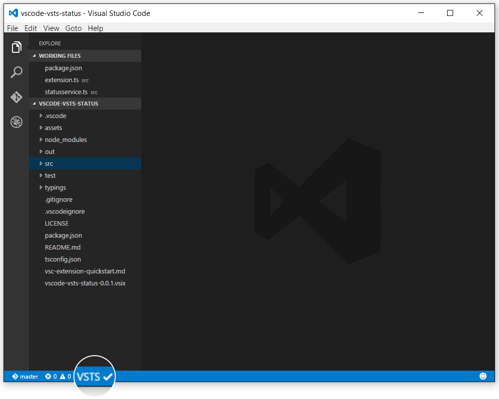

# Visual Studio Team Services health extension

Visual Studio Team Services health indicator right in the Visual Studio Code status bar. The extension periodically checks the Visual Studio Team Services [support page](https://www.visualstudio.com/support/support-overview-vs) and displays a health indicator in the Visual Studio Code status bar. Hover over the health indicatory to see the service status message, and click on the health indicator to open the Visual Studio Team Services [support page](https://www.visualstudio.com/support/support-overview-vs).

## License
MIT. For more details check [LICENSE](LICENSE).
